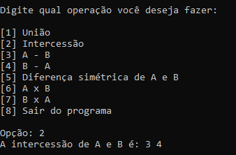

# Esse trabalho é uma calculadora de conjuntos numéricos em C
## Sobre os caracteres:

Em C, você precisa de uma biblioteca para que os caracteres apareçam de forma normal. Nesse código, eu usei a biblioteca locale. h :

  

escrevendo o codigo setlocale(LC_ALL, "portuguese") na função 
main:  

  

após, vá no canto inferior direito do editor de código (VSCDODE) e clique em UTF -8:    

  

depois clique em open with Encoding e, logo após, em ISO 8859-1.

OBS: Talvez você tenha que editar as palavras após esse processo.

## Sobre o código:
Na execução, ele te mostra o menu da calculadora de conjuntos e cada número corresponde a uma operação:

  

  

### Exemplo de cada sendo A = {1, 2, 3, 4}  e B = {3, 4, 5, 6} :

#### União

  

### Intercessão

  

### A - B

  

### B - A

  

### Diferença simétrica

  

### A x B

  

### B x A

  

 
